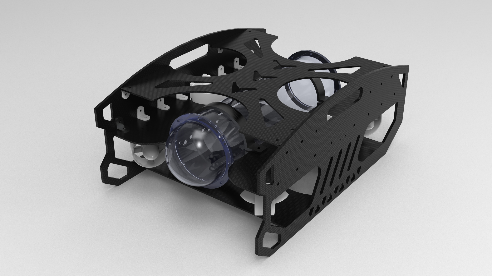
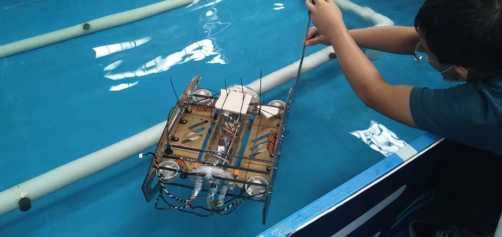

# Underwater-Robot
Date: 2020.6 - 2020.10    
Introduction: We designed an Underwater Robot that can **adapt to dive** in the underwater environment and **detect and track the pipeline**; In 2020, our **Underwater Robot Project** represented Hefei University of Technology to participate in the nternational Underwater Robot Competiotion, and finally won the 3rd.

